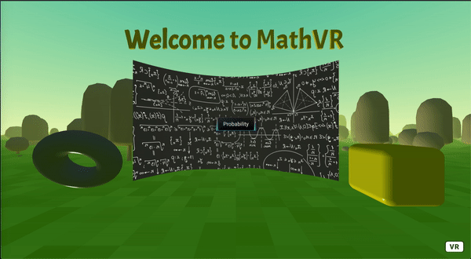

# MathVR



# Learn mathematics through interactive VR experiments

## Link

This project is [live on GitHub Pages](https://amirhmk.github.io/MathVR/)

**Note**: To enter 360 VR mode, click the `VR` button on the bottom right hand side!

## About

Math topics can be challenging to grasp sometimes, and [@quentinv72](https://github.com/quentinv72) and I thought demonstrating them in interactive experiments in a VR environment could help with that. As a first step, we wanted to use **random experiments** to illustrate Law of Large Numbers with a whole lot of dice falling down from the sky.

As we wanted this to be a web application that is easily accessible, we chose `A-Frame` as framework. This means that **any browser on a VR or any other device should** be able to run this. However,  we highly recommend you to use a VR headset for the best experience!

`A-Frame` is an easy-to-configure library based on `Three.js`, which gives us flexibility in our devlopment cycle in case we need it.

## Development

Requirements:

- Node 12+
- Npm

### Installation

First install the dependencies:

```shell
$ npm install
```

### Run

To run locally:

```shell
$ npm start
```

Local instance will be served on `localhost:9000`
